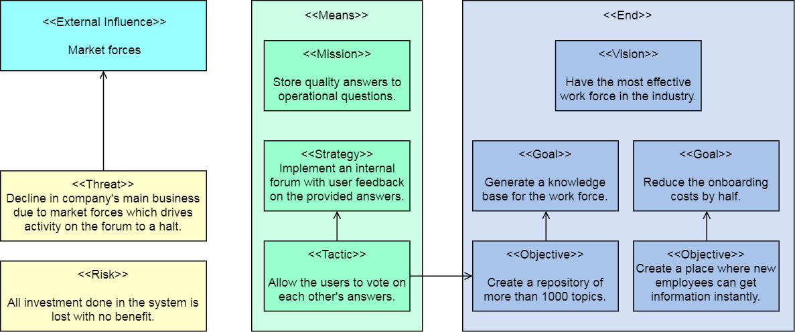
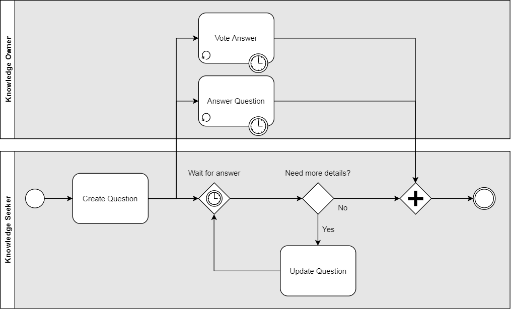
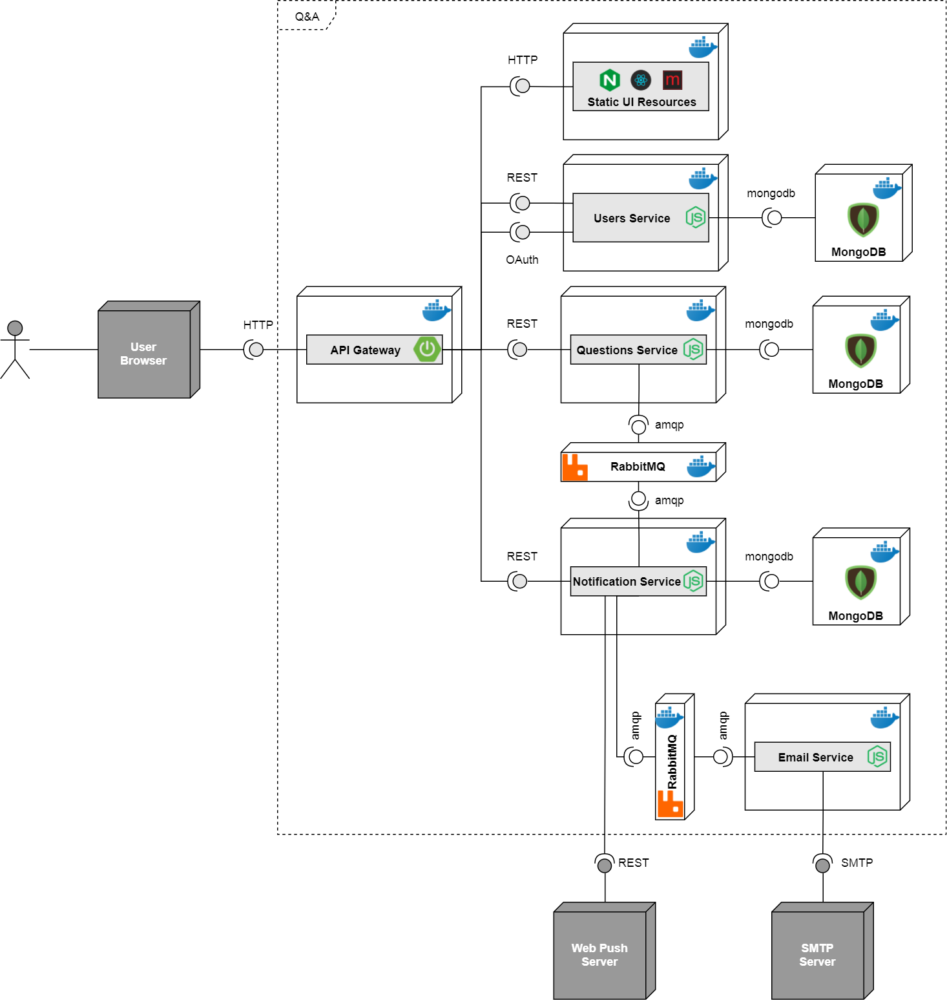
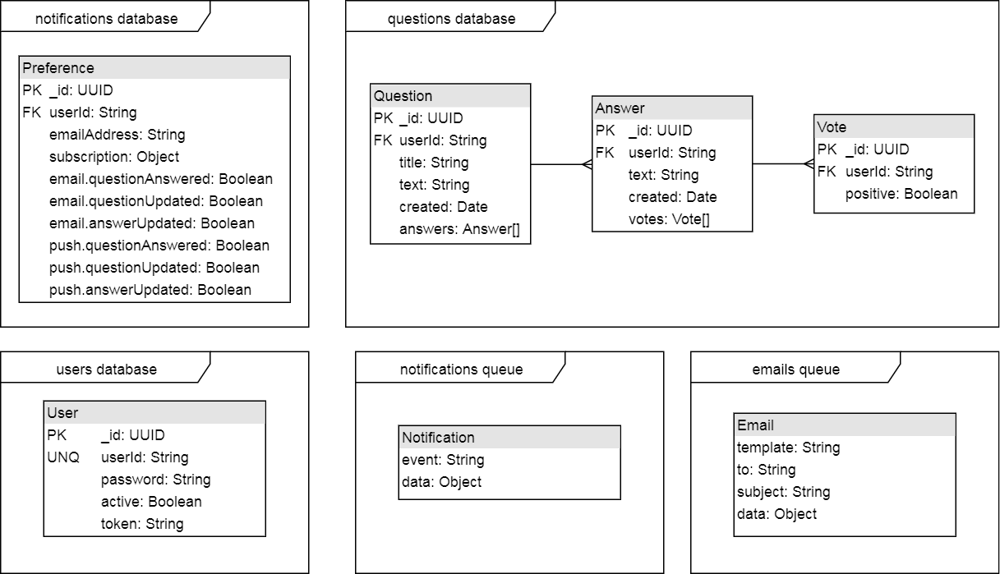
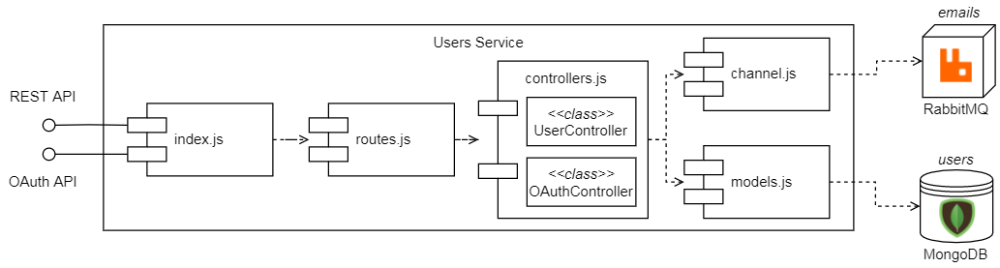
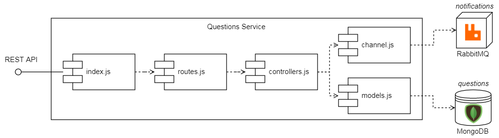
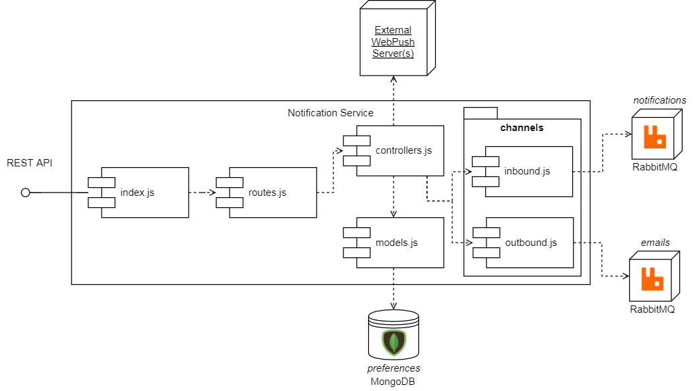
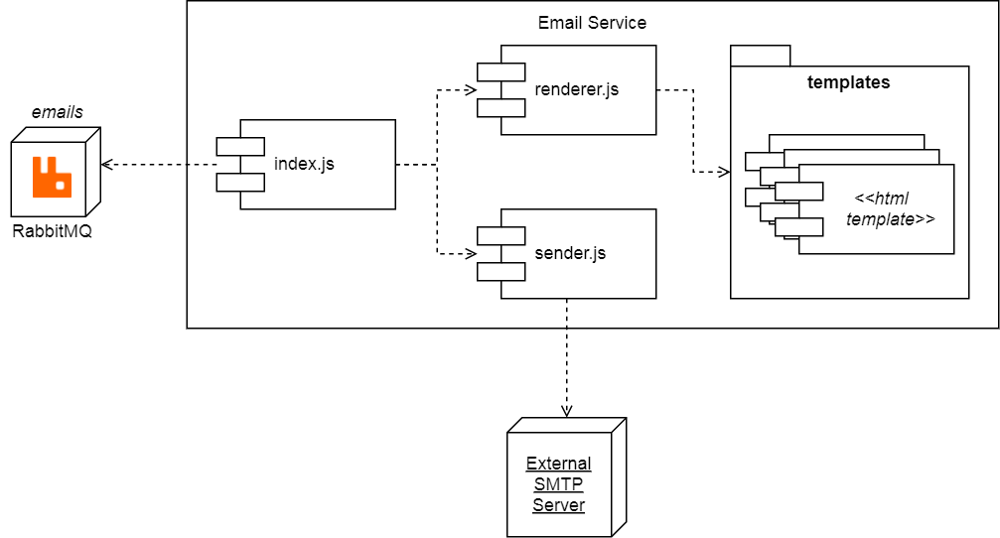
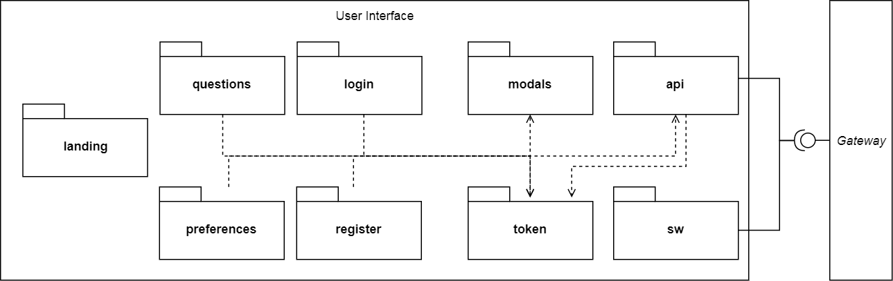
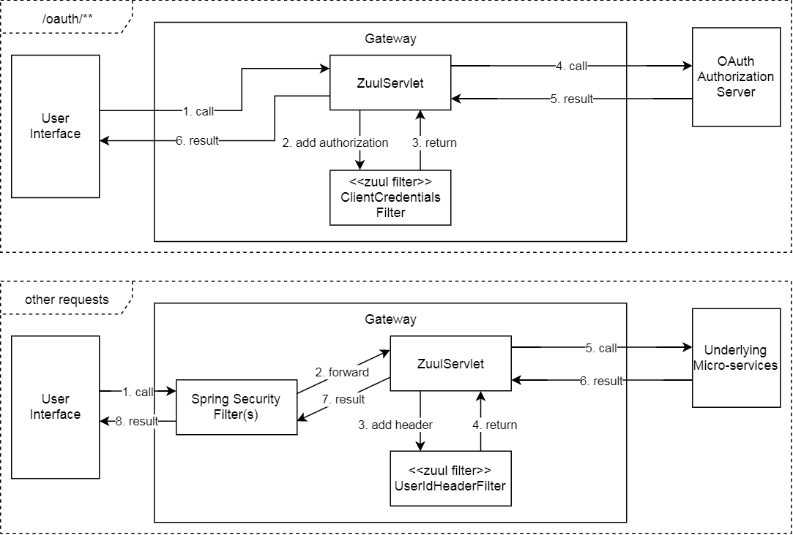

# UBB SOA Master Course: Q&amp;A Project
This project was developed for the SOA course of the Software Engineering master degree at UBB Cluj-Napoca.

It is a simple Q&amp;A (Questions and Answers) forum-like system based on a micro-service architecture and deployed on docker.

Throughout this documentation, we will refer to the customer of this system as *ABC Inc.*, large development company which requires a platform for connecting its employees and sharing knowledge amongst them (but is too cheap to buy [StackOverflow for teams](https://stackoverflow.com/teams)).

## Table of contents
 - [Setup and Usage](#setup-and-usage)
 - [Business Overview](#business-overview)
 - [Components](#components)
   * [Users Service](#users-service)
   * [Questions Service](#questions-service)
   * [Notification Service](#notification-service)
   * [Email Service](#email-service)
   * [User Interface](#user-interface)
   * [API Gateway](#api-gateway)
 - [External Systems](#external-systems)
 - [Integration Patterns](#integration-patterns)

## Setup and Usage
[Docker](https://www.docker.com/get-started) is required for running this project.

All the source code is provided in this repository. Once cloned or downloaded locally, the system may be build and started by running the following command inside the root of the local repository: `docker-compose up --build`.

Depending on your docker version and settings, the UI will now be accessible on either [https://localhost/app/index.html](https://localhost/app/index.html) or [https://192.168.99.100/app/index.html](https://192.168.99.100/app/index.html). The `.env` file contains an entry `UI_BASE_URL` which must be adjusted accordingly in order for the registration emails to contain the correct URLs.

Due to the fact that the user interface uses [Service Workers](https://developer.mozilla.org/en-US/docs/Web/API/Service_Worker_API), SSL/TLS was enabled using a self-signed certificate. In order to get the [Push Notifications working](https://developer.mozilla.org/en-US/docs/Web/API/Push_API), either the certificate located at `gateway/qanda.p12` must be added to your trust store or your browser must ignore the certificate errors. In Chrome, this may be done using the following argument [--ignore-certificate-errors](https://superuser.com/a/1036062).

In place of a real email server, a dummy SMTP is also deployed inside a Docker container. This server fully emulates a real SMTP server, but stores all the incoming messages in memory and exposes them through a REST API and a HTML user interface. The list of sent emails can be accessed at [http://localhost:1080/](http://localhost:1080/) or [http://192.168.99.100:1080/)](http://192.168.99.100:1080/).

## Business Overview
*ABC Inc.*, which is a large IT software company, performs an analysis of the development costs for its products. It is revealed that due to the very specific technical approach of their products, a lot of time is wasted on-boarding new employees. To mitigate this, the board decides to commission a dedicated Q&amp;A system for sharing knowledge amongst the workforce.

There is one main business process driving the system:
 - A *knowledge seeker* (typically a new employee) asks a question.
 - Iteratively:
    * The *knowledge owners* (typically more senior employees) answer.
    * The *knowledge seeker* updates his question in response to the answers (e.g. to provide further information).
    * The *knowledge owners* vote on each other's answers.
 - Finally, the *knowledge seeker* selects one (or more answers) and applies this knowledge in his work area.

## Components
Deployment and component diagram:

Guiding principles:

 * All configuration related to the environment (database URLs, external system URLs, other micro-service URLs, etc) are obtained from environment variables which are ultimately populated from the `docker-compose` file.
 * The data is stored inside `MongoDB` NoSQL database instances, where each micro-service has its own database. The database collections are **NOT** schema-less, but the database schema is enforced using [Mongoose](https://mongoosejs.com/).
 * All the inbound HTTP traffic is routed through the API Gateway, which also acts as a gatekeeper by enforcing security (it is an *OAuth Resource Server*).
 * The notifications are issued asynchronously, by enqueueing messages inside `RabbitMQ` instances (Which are then consumed by worker services).
 * All micro-services are stateless, that is they do not store any data in their own memory, but use backing services (MongoDB, RabbitMQ) for persistence. The user information is passed via headers in all HTTP exchanges and via a dedicated JSON field in all AMQP exchanges. 

Data model (including the message structure in the queues):

### Users Service
API interface definition: [markdown](./swagger/users.md), [yaml](./swagger/users.yaml).

Micro-service responsible for managing users:
 * Provides a registration and activation mechanism with the help of the email service (for sending registration emails).
 * Exposes a simplified OAuth Authorization Server interface for performing logins (via the `password` grant).

When registering a new user, a unique UUID is generated and sent (as part of a link) to the user's email address. When the user accesses this link, the account is activated and may be used for login.

The communication with the email service is done through the *emails* queue by passing in JSON messages. 

For persisting the user entities, it uses the *users* MongoDB database collection.

For authentication, a simple OAuth Authorization Server was implemented. It only supports the password grant and only handles requests from one client (whose ID and secret is taken from the environment). It generates JWT tokens, which are symmetrically signed using the HS256 algorithm and the key provided in the environment.

Technological stack: node-js, express, amqplib, mongoose. 

### Questions Service
API interface definition: [markdown](./swagger/questions.md), [yaml](./swagger/questions.yaml).

Micro-service for handling questions, answers and votes. It provides basic CRUD APIs with pagination for all the before-mentioned entities.

Whenever a question is answered, a question is updated or an answer is updated, a notification is generated by writing a message inside the *notifications* queue (which is later consumed by the notification service).

For persisting the question documents, it uses the *questions* MongoDB database collection.

Technological stack: node-js, express, amqplib, mongoose. 

### Notification Service
API interface definition: [markdown](./swagger/notifications.md), [yaml](./swagger/notifications.yaml).

Micro-service for generating notifications and managing user preferences related to notifications.

It exposes a REST API for enabling and disabling notifications (email and push) and consumes the *notifications* queue of events as the basis for sending the notifications out to the users.

For email notifications, it defers the generation and transmission of the email messages to the email service (with whom it communicates via the *email* queue).

For persisting the user preferences, it uses the *notifications* MongoDB database collection.

Technological stack: node-js, express, amqplib, mongoose, web-push. 

### Email Service
Micro-service for generating email messages and sending them via SMTP.

This micro-service does not have a REST API, but receives all its work via the *emails* queue. It uses the messages received through the queue to select a HTML template, a subject, a destination address and to fill in the HTML template, which is then used as the body of the email.

Technological stack: node-js, amqplib, nodemailer. 

### User Interface
The user interface is a single page web application.
 

It is organized in the following packages:
 * landing: the static landing page for not-yet-logged-in users.
 * login: the login page.
 * register: the registration page.
 * questions: UI components for displaying, creating and editing the questions, answers and votes.
 * preferences: the notification preferences management page.
 * sw: the service worker definition for handing web push notifications.

The following packages do not contain only UI components, but utilities used throughout the application:
 * modals: various popups (for error messages, for editing text, etc.). 
 * token: package dedicated to holding the JWT token, parsing it and managing its lifecycle (including expiration).
 * api: package encapsulating all operations to the backend (excluding the service worker).

Technological stack: react, minicss. At runtime, it is served by an NGINX server. 

### API Gateway
The single point of entry for all inbound communication is the API Gateway. It routes the traffic based on the following rules:
 * `/oauth/**` - routed towards the users' service *OAuth* endpoint.
 * `/users/**` - routed towards the users' service *users* endpoint.
 * `/notifications/**` - routed towards the notifications' service endpoints.
 * `/questions/**` - routed towards the questions' service endpoints.
 * `/app/**` - routed towards the static UI resources.

It has three main flows:
 * For all requests on the `/app/**` and `/users/**` route, it does not perform any changes.
 * For all requests on the `/oauth/**` route, it does not check the authentication, but injects the OAUth client credentials in the forwarded request's headers.  
 * For all the other requests, it check that a JWT token is present with the right signature, remove it from the forwarded request's header and injects a `X-User-ID` header instead.

## External Systems
The system has two external dependencies:
 * An SMTP server for sending the email messages. For development purposes, a fake SMTP server was also deployed in a Docker container.
 * One or more Web Push API servers. The exact URL of these APIs is determined at runtime from the push subscription information returned by the user' browsers.

## Integration Patterns
Message patterns:
 * Request-reply: for all the REST endpoints (due to the nature of REST / HTTP).
 * Document message: the messages sent via the *notifications* queue. The notification service consumes these messages and *may* issue a notification based on them.
 * Command message: the messages sent via the *emails* queue. The email service will always attempt to generate an email message based on each of the messages from this queue.

Endpoint patterns:
 * Message endpoint: in all the services where the queues were accessed.
 * Competing consumers: both the email service and the notification service may be scaled to consume the messages in the queues concurrently.

Routing patterns:
 * Message broker: the API gateway.

Transformation patterns:
 * Content enricher / claim check: the API gateway check the JWT tokens of inbound calls and injects further headers to the downstream requests.

Channel patterns:
 * Message channel.
